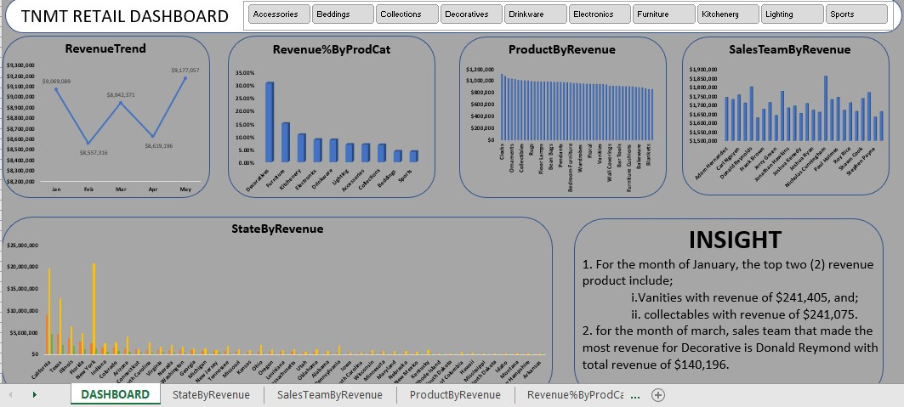
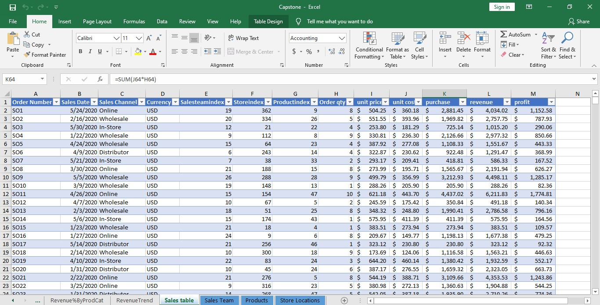
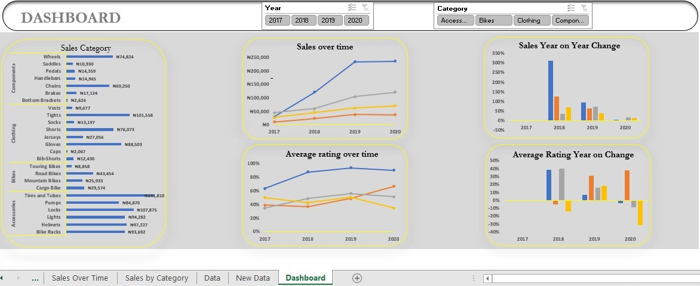
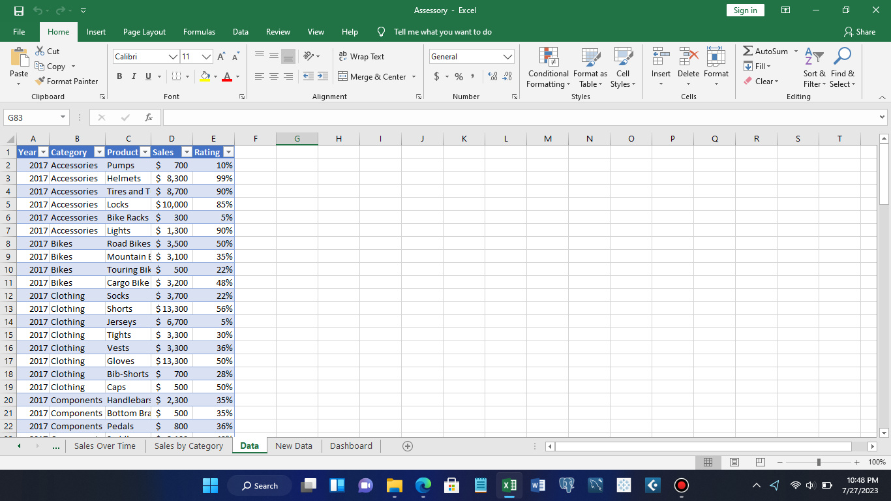
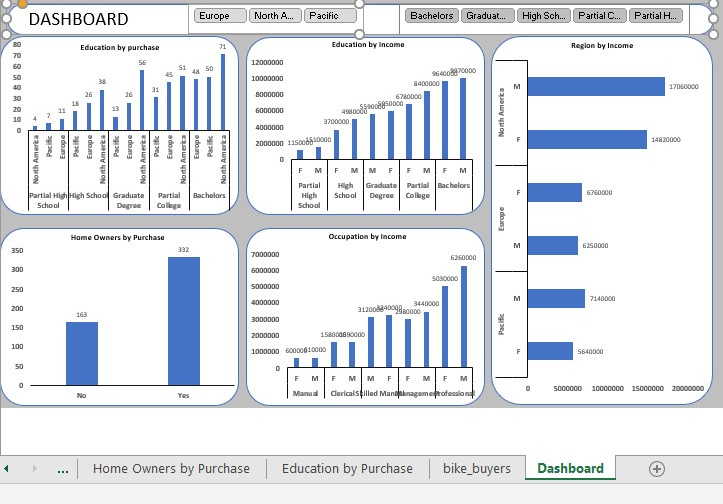
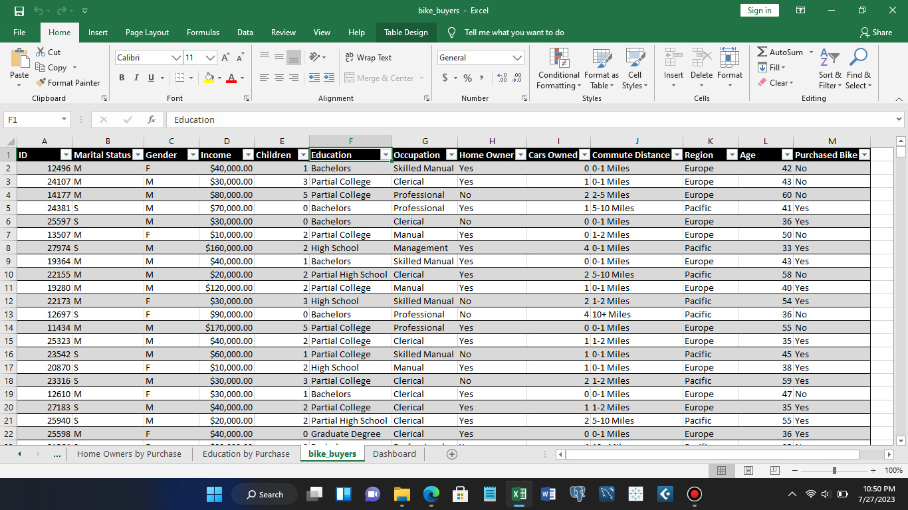
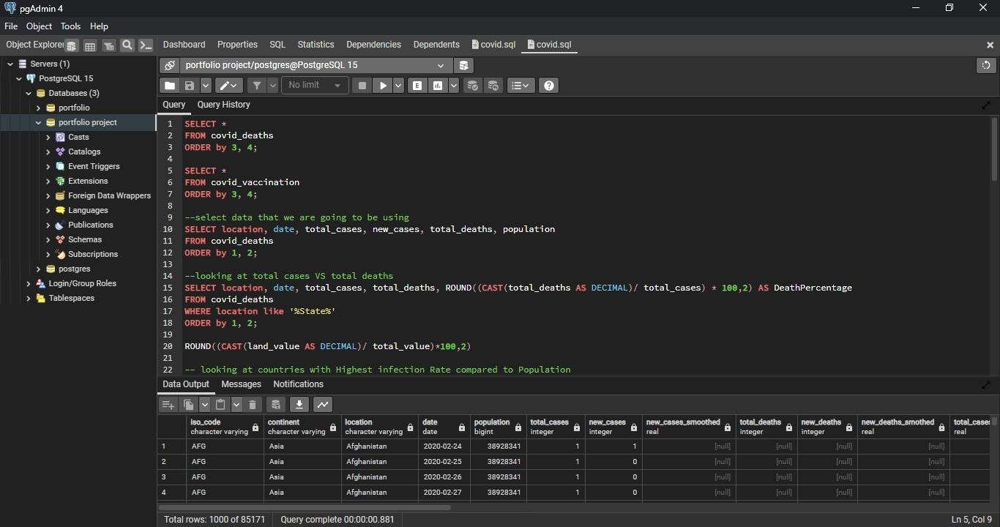
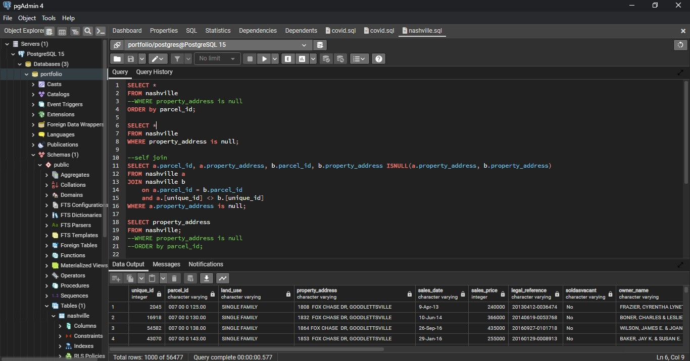
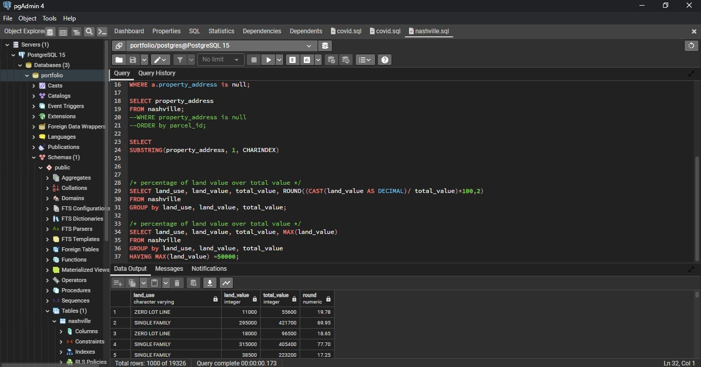
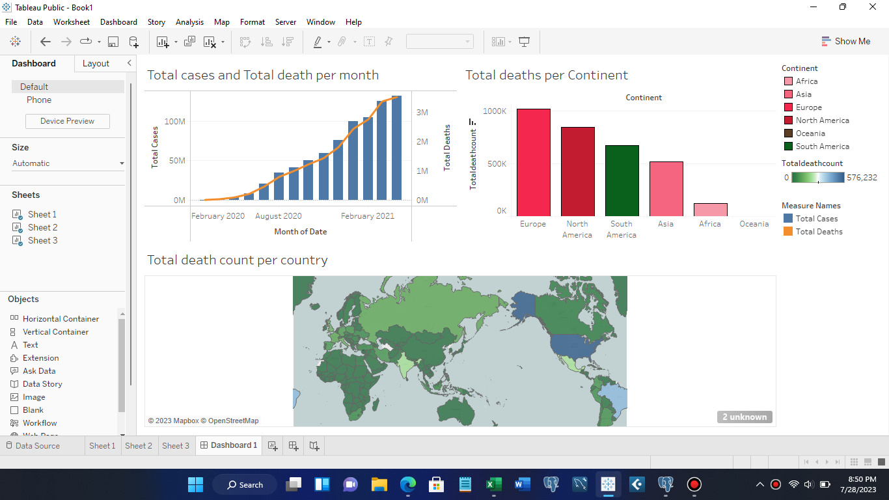

# Akinjohnson's Data Analysis Portfolio

## Introduction
Hello!!!

Welcome to my Data Analysis Portfolio. I am a data analyst and a problem solver, passionate about using data-driven insights to help businesses make informed decisions. I specialize in analyzing complex data sets and communicating insights in a clear and concise manner. With a background in mathematics and statistics, I have the technical skills necessary to handle any data-related challenge. This website serves as a showcase of my work and skills. Take a look at my portfolio to see examples of my data analysis projects. If you're interested in working together, please don't hesitate to contact me.

## Projects

### Excel Projects
#### **Project 1: Revenue performance Analysis on Capstone**

Description: Analysed a company's sales data to identify trends, patterns, and potential areas of improvement.

Skills Demonstrated: 
- Data Cleaning and Preprocessiong
- Use of pivot tables and power query
- Visualization with Excel

Capstone Dashboard    |    capstone Data
:--------------------:|:----------------------:
     | 

#### **Project 2: Revenue performance Analysis on an Accessory store**

Description: Developed am interactive Excel dashboard that provides an in-depth analysis of Revenue data for a Fictional company.

Skills Demonstrated: 
- Data Cleaning
- Use of pivot tables and power query
- Visualization with Excel
- Data Analysis
- Filtering

 Accessory Dashboard  |   Accessory Data
:--------------------:|:----------------------:
    | 

#### **Project 3: Analysis of Bike Owners**

Description: Connducted a fictional Data analysis on bike owners.

Skills Demonstrated: 
- Data Cleaning
- Use of pivot tables and power query
- Visualization with Excel
- Data Analysis
- Filtering

 Bike buyer's Dashboard  |  Bike buyer's Data
:--------------------:|:----------------------------:
    | 

### SQL Projects
#### **Project 1: COVID-19 Data analysis**

Description: Analysed global COVID-19 data to track the spread and impact of the virus.

Skills Demonstrated:
- Data Cleaning and integration from PostgreSQL
- Use of complex query to draft out relevant tables
- SQL Subqueries
- SQL Joins

Queries 1      |      Qeries 2
:-------------:|:---------------:
| 

#### **Project 2: Nashville Housing Analysis**

Description: Analysed global COVID-19 data to track the spread and impact of the virus.

Skills Demonstrated:
- Data Cleaning and integration from PostgreSQL
- SQL Subqueries
- SQL Joins

Queries 1          |      Qeries 2
:-----------------:|:-------------------:
| 

### Visualization Projects
#### **Project 1: COVID-19 Data analysis Dashboard**

Description: Visualized a global COVID-19 data to track the spread and impact of the virus.

Skills Demonstrated:
- Data Visualization
- Dashboard Design and user Experience
- Interactive Dashboard
- Geaspatial Analysis

  Covid Dashboard      
  

## Conclusion
Thank you for visiting my data analysis portfolio!

These project represent a glimpse of my capabilities as a data analyst. i am always eager to take on new challenges and contribute to data-driven decision-making. If you are interested in collaborating or discussing opportunities, please feel free to reach out to me.

## Contact
Linkedin:- 

Email:- akinjohnson06@gmail.com

Tel:- (+234) 812-387-6885

Address:- Mowe-Ofada, Ogun State, Nigeria

### **_Lets explore the world together!!!_**
